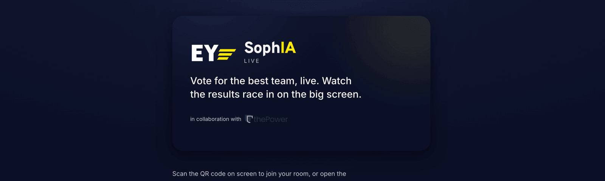

# EY SophIA Live — Votación en vivo para talleres · EY SophIA × thePower

**En vivo:** https://ey-sophia-live-joseluisalmendrals-projects.vercel.app

## Qué es

Votación en vivo pensada para talleres y eventos: los asistentes escanean un **QR** y votan
desde el **móvil**, mientras los **resultados se animan en tiempo real** en la pantalla de
proyección. Al cerrar, la app hace la **revelación del ganador** con podio, corona y confetti.
Todo es **mobile-first** y en **tiempo real**.

## Características

- **Votación anónima**, 1 voto por dispositivo, **sin PII**.
- **Pantalla de proyección** con gráficas en vivo (barras / dona / columnas).
- **Panel de administración multi-usuario** con acceso por **magic-link**.
- **Cuenta atrás** con **auto-cierre** para votaciones cronometradas.
- **Revelación en 3 tiempos** (suspense → podio + corona + confetti → reposo).
- **Analytics sin PII**.

## Stack

Next.js 16 (App Router) · React 19 · TypeScript · Tailwind v4 · Supabase (Postgres + Realtime) ·
Vercel · Motion · ECharts.

## Cómo correr en local

```bash
pnpm install
pnpm build
pnpm start   # sirve la build de producción en http://localhost:3000
```

`.env.local` apunta a la Supabase real, así que en local trabajas contra la base de datos y
el realtime de producción.

## Enlaces

- [RUNBOOK.md](RUNBOOK.md) — guía de operación (pruebas y día del evento).
- [LIMITS.md](LIMITS.md) — límites y capacidad.

## Nota

Proyecto privado / interno. El logo de EY es una **recreación fiel** para desarrollo; usa el
**asset oficial** de EY para el evento real.
